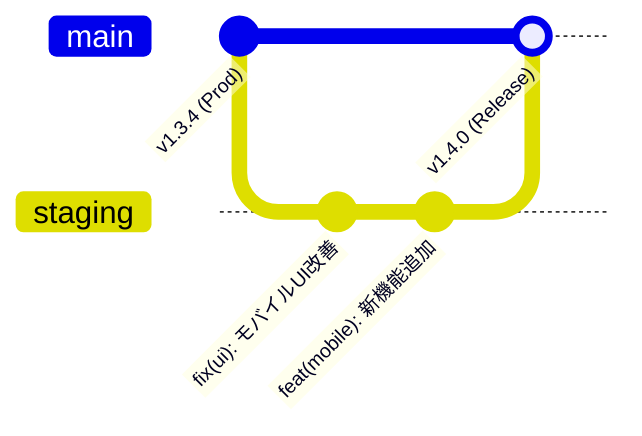

# Cloudflare Pages × GitHub ステージング環境構築ガイド

本番の運用データ（実タスク）にデグレ等の影響を一切与えずに、最新のUIや新機能をスマホ（Cloudflare Pages PWA）から安全に検証するための**「ステージング環境一式（アプリ・データ・片方向同期）」**の構築手順書です。

---

## 🏗️ 全体アーキテクチャ

```mermaid
flowchart TD
    subgraph "💻 アプリコード (obsidian-todo-calendar)"
        MainBranch["main ブランチ<br>(本番コード)"]
        StgBranch["staging ブランチ<br>(検証用コード)"]
    end

    subgraph "☁️ Cloudflare Pages (Hosting)"
        ProdCF["本番 Cloudflare Pages<br>(例: todo-cal.pages.dev)"]
        StgCF["検証 Cloudflare Pages<br>(例: todo-cal-staging.pages.dev)"]
    end

    subgraph "🐙 データリポジトリ (GitHub Private)"
        ProdData["本番 Vault リポジトリ<br>(例: my-vault)"]
        StgData["検証 Vault リポジトリ<br>(例: my-vault-staging)"]
    end

    subgraph "📱 スマホ (PWA)"
        ProdPWA["本番 PWA<br>(ホーム画面: 本番アイコン)"]
        StgPWA["検証 PWA<br>(ホーム画面: 🧪 Staging)"]
    end

    %% コードデプロイの流れ
    MainBranch -->|自動ビルド| ProdCF
    StgBranch -->|自動ビルド| StgCF

    ProdCF -->|配信| ProdPWA
    StgCF -->|配信| StgPWA

    %% データの流れ
    ProdPWA <-->|双方向同期| ProdData
    StgPWA <-->|安全に読み書きテスト可能| StgData

    %% 片方向同期
    ProdData -.->|片方向ミラー同期 (GitHub Actions / 手動)<br>force-push| StgData
```

### ✨ メリット
1. **本番データ完全保護**: ステージング PWA からタスクの完了・削除・編集をどれだけ行っても、影響を受けるのは `my-vault-staging` だけです。
2. **リアルな実データで検証**: 本番の最新データをステージング用リポジトリにコピー（上書き反映）するため、常にリアルなタスクで UI/UX をテストできます。
3. **スマホで2台持ち可能**: Cloudflare Pages のプロジェクトを分けることで、スマホのホーム画面に「本番 PWA」と「検証 PWA」の両方を並べてインストールできます。

---

## 🚀 ステージング環境の構築手順 (5ステップ)

---

### ステップ 1: ステージング用データリポジトリの作成

1. [GitHub - Create a new repository](https://github.com/new) を開きます。
2. 設定項目:
   - **Repository name**: 本番データリポジトリ名 + `-staging`（例: `my-todo-vault-staging`）
   - **Private** を選択（README 追加チェックは外す）
3. 「Create repository」をクリックして空のリポジトリを作成します。

---

### ステップ 2: 本番データ → ステージングデータの片方向同期を設定

本番データをステージングに反映する方法は **「A. GitHub Actions 自動同期（推奨）」** または **「B. 手動スクリプト同期」** の2種類から選べます。

#### パターン A: GitHub Actions 自動同期（推奨）
本番 Vault リポジトリに push された時、自動でステージングリポジトリへ force-push ミラーします。

1. **GitHub PAT (Personal Access Token) の用意**:
   - [Fine-grained Personal Access Tokens](https://github.com/settings/tokens?type=beta) を開く。
   - ステージング用リポジトリ（`my-todo-vault-staging`）に対して **Contents: Read and write** 権限を持つトークンを用意（※既存のトークンが All repositories または当該リポジトリを含んでいれば再利用可）。
2. **本番 Vault リポジトリの Secrets 登録**:
   - 本番 Vault リポジトリの **Settings** → **Secrets and variables** → **Actions** を開く。
   - 以下の 3 つの Repository Secret を登録:
     - `STAGING_SYNC_PAT`: 作成した GitHub PAT
     - `STAGING_OWNER`: GitHub ユーザー名（例: `hatomachi`）
     - `STAGING_REPO`: ステージングリポジトリ名（例: `my-todo-vault-staging`）
3. **ワークフローファイルの配置**:
   - 本番 Vault リポジトリの `.github/workflows/sync-to-staging.yml` に [templates/sync-to-staging.yml](file:///Users/s-ikari/work/obsidian-todo-calendar/templates/sync-to-staging.yml) の内容を配置して push します。
   - 以降、本番 Vault が更新されるたびにステージング Vault も自動で最新化されます。

#### パターン B: 手動ワンライナー / スクリプト同期
ローカル PC から手動で同期したい場合は、以下のいずれかを実行します。

**方法 1 (付属スクリプト):**
```bash
./scripts/sync-vault-staging.sh /path/to/your-vault git@github.com:<owner>/<staging-repo>.git
```

**方法 2 (Git remote 直接 push):**
```bash
cd /path/to/your-vault
git remote add staging git@github.com:<owner>/<staging-repo>.git  # 初回のみ
git push staging main:main --force
```

---

### ステップ 3: アプリコード側の staging ブランチ作成

アプリリポジトリ (`obsidian-todo-calendar`) でステージング用のブランチを作成・プッシュします。

```bash
cd /Users/s-ikari/work/obsidian-todo-calendar
git checkout -b staging
git push -u origin staging
```

---

### ステップ 4: Cloudflare Pages にステージングプロジェクトを作成

1. [Cloudflare ダッシュボード](https://dash.cloudflare.com/) にログイン。
2. 左メニュー **「Workers & Pages」** → **「Create application」** → **「Pages」** タブ → **「Connect to Git」**。
3. `obsidian-todo-calendar` リポジトリを選択。
4. ビルド設定を入力：
   - **Project name**: `obsidian-todo-calendar-staging`（任意・本番と区別できる名前）
   - **Production branch**: `staging`
   - **Framework preset**: `Vite` (または None)
   - **Build command**: `npm run build:web`
   - **Build output directory**: `dist`
5. **「Save and Deploy」** をクリック。

> 💡 **自動デプロイ**:
> これにより、ローカルで `git push origin staging` するだけで、ステージング専用 URL（`https://obsidian-todo-calendar-staging.pages.dev`）に即座に最新検証版が反映されます。

---

### ステップ 5: スマホでの初期接続 & PWA 登録

1. スマホのブラウザで、ステップ 4 で発行されたステージング URL を開きます。
2. 右上の ⚙️（設定）を開き、以下を入力して接続テスト＆保存します：
   - **Token**: 発行済みの GitHub PAT
   - **Owner**: ご自身の GitHub ユーザー名（例: `hatomachi`）
   - **Repo**: ステージング用リポジトリ名（例: `my-todo-vault-staging`）
   - **Branch**: `main`
3. 画面左上のバッジが **`🧪 Staging (<repo名>)`** とオレンジ色で表示されることを確認します。
4. **ホーム画面に追加**:
   - iOS: 共有メニュー → **「ホーム画面に追加」**（名前を `TODO Cal (Stg)` などに設定）
   - Android: メニュー → **「ホーム画面に追加」**

---

## 🔄 日常の検証・リリース運用フロー



1. **開発・検証フェーズ**:
   - `staging` ブランチでコードを修正し、`git push origin staging`。
   - スマホの **`TODO Cal (Stg)`** を開き、動作・UI を検証。
   - ステージング用データリポジトリ上で自由にタスクの追加・削除・編集を試す（本番データは無傷）。
2. **本番リリースフェーズ**:
   - 検証が完了したら、`staging` を `main` にマージして push ＆ バージョンタグを打つ。
   - 本番用 Cloudflare Pages および GitHub Releases が自動更新されます。
3. **ステージングデータの最新化**:
   - 検証データが散らかって本番データに戻したくなったら、GitHub Actions の「Run workflow」または手動スクリプトで本番データを force-push 上書きすれば一瞬でリフレッシュ完了です。
